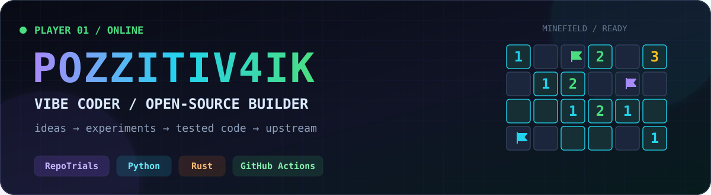
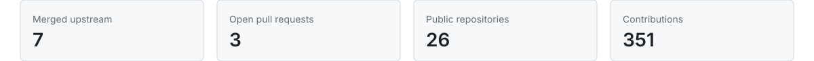

<!-- Generated by scripts/generate_profile.py. Edit this template, not README.md. -->

<p align="center">
  
</p>

<p align="center">
  <a href="https://github.com/PozziTiv4ik/Repo-Trials"><strong>RepoTrials</strong></a>
  ·
  <a href="https://github.com/pulls?q=is%3Apr+author%3APozziTiv4ik"><strong>Upstream work</strong></a>
  ·
  <a href="https://github.com/PozziTiv4ik?tab=repositories"><strong>Projects</strong></a>
</p>

<p align="center">
  
  
  
</p>

<p align="center">
  
</p>

## Hey, I'm PozziTiv4ik

**A vibe coder with a verification habit.** I move quickly from an idea to something that runs, then use tests, CI, and maintainer feedback to turn the vibe into dependable code.

I am currently learning in public through developer tooling, coding-agent evaluation, and focused upstream contributions in Python and Rust.

> Fast experiments are the start. Reproducible results are the finish.

## Building: RepoTrials

<a href="https://github.com/PozziTiv4ik/Repo-Trials">
  
</a>

**[RepoTrials](https://github.com/PozziTiv4ik/Repo-Trials)** turns bugs a team has already fixed into private regression tasks for evaluating coding agents. It mines real Git history, proves BASE/RED/GOLD transitions, runs repeated trials, and produces auditable reports.

- local-first: source, tasks, and verifier material stay on your machine
- agent-agnostic: works with any command-driven coding agent
- evidence-driven: hidden tests and reproducible state transitions
- exportable: accepted tasks can be packaged for [Harbor](https://github.com/harbor-framework/harbor)

<p align="center">
  <a href="https://github.com/PozziTiv4ik/Repo-Trials"><strong>Explore the project</strong></a>
  ·
  <a href="https://github.com/PozziTiv4ik/Repo-Trials#try-it-in-60-seconds"><strong>Try the demo</strong></a>
  ·
  <a href="https://github.com/PozziTiv4ik/Repo-Trials/discussions"><strong>Join the discussion</strong></a>
</p>

## Shipped upstream

Real changes accepted into projects I did not own:

| Project | Merged contribution | Date |
|---|---|---:|
| [mloda-ai/mloda](https://github.com/mloda-ai/mloda) | [test: cover execution plan error branches](https://github.com/mloda-ai/mloda/pull/1133) | 2026-08-16 |
| [wingfoil-io/wingfoil](https://github.com/wingfoil-io/wingfoil) | [feat(ops): add skip combinator](https://github.com/wingfoil-io/wingfoil/pull/846) | 2026-08-15 |
| [bruits/satteri](https://github.com/bruits/satteri) | [test(parser): lock blockquote child positions](https://github.com/bruits/satteri/pull/247) | 2026-08-15 |

## How I work

```text
idea → smallest useful change → regression proof → CI → maintainer feedback → shipped
```

- I prefer a focused patch over a giant rewrite.
- I treat green checks as evidence, not decoration.
- I keep iterating until the change is useful upstream.
- I am comfortable learning an unfamiliar codebase in public.

## Toolbox

<p>
  
  
  
  
  
</p>

## Contribution minefield

This is my contribution board reimagined as a game of **Minesweeper**. A tiny player picks safe cells, triggers three reveal cascades, spots a dangerous square, plants flags, clears the mine counter, and celebrates the win. The board and scoreboard are generated from live public GitHub activity.

<p align="center">
  
</p>

<sub>Profile metrics and the minefield refresh automatically from public GitHub data. Last refresh: 2026-08-16 UTC.</sub>
